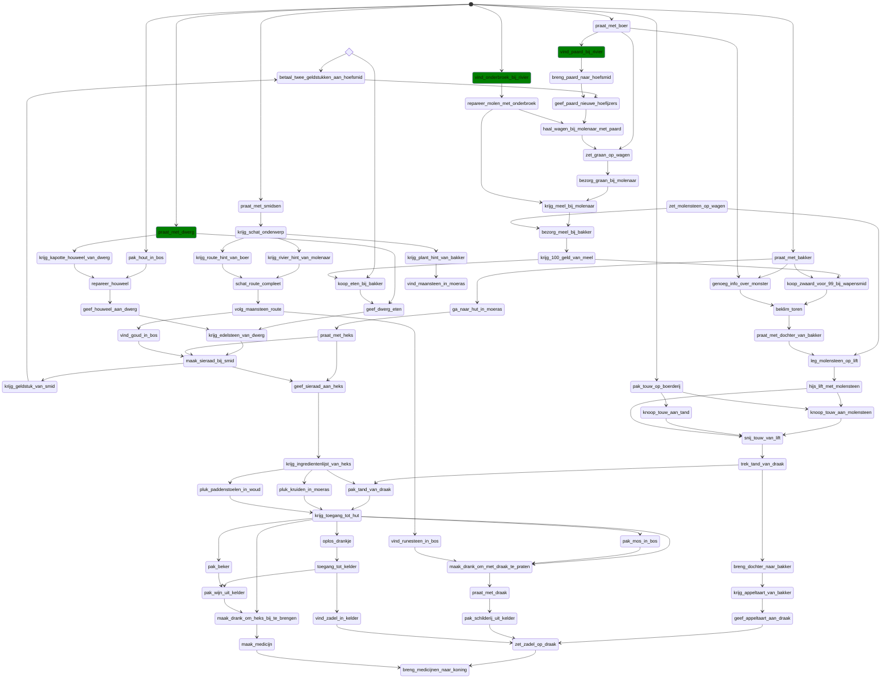

# Puzzle dependency diagram

```mermaid
stateDiagram
  classDef done fill:green

  koop_zwaard_voor_99_bij_wapensmid --> beklim_toren
  genoeg_info_over_monster --> beklim_toren

  state betaal_twee_geldstukken <<choice>>

  betaal_twee_geldstukken --> betaal_twee_geldstukken_aan_hoefsmid
  krijg_geldstuk_van_smid --> betaal_twee_geldstukken_aan_hoefsmid

  zet_graan_op_wagen --> bezorg_graan_bij_molenaar
  krijg_meel_bij_molenaar --> bezorg_meel_bij_bakker

  trek_tand_van_draak --> breng_dochter_naar_bakker

  zet_zadel_op_draak --> breng_medicijnen_naar_koning
  maak_medicijn --> breng_medicijnen_naar_koning

  vind_paard_bij_rivier --> breng_paard_naar_hoefsmid

  praat_met_bakker --> ga_naar_hut_in_moeras

  krijg_appeltaart_van_bakker --> geef_appeltaart_aan_draak

  praat_met_dwerg --> geef_dwerg_eten
  koop_eten_bij_bakker --> geef_dwerg_eten

  repareer_houweel --> geef_houweel_aan_dwerg

  betaal_twee_geldstukken_aan_hoefsmid --> geef_paard_nieuwe_hoefijzers
  breng_paard_naar_hoefsmid --> geef_paard_nieuwe_hoefijzers

  praat_met_heks --> geef_sieraad_aan_heks
  maak_sieraad_bij_smid --> geef_sieraad_aan_heks

  praat_met_bakker --> genoeg_info_over_monster
  praat_met_boer --> genoeg_info_over_monster

  geef_paard_nieuwe_hoefijzers --> haal_wagen_bij_molenaar_met_paard

  repareer_molen_met_onderbroek --> haal_wagen_bij_molenaar_met_paard

  leg_molensteen_op_lift --> hijs_lift_met_molensteen

  hijs_lift_met_molensteen --> knoop_touw_aan_molensteen
  pak_touw_op_boerderij --> knoop_touw_aan_molensteen
  pak_touw_op_boerderij --> knoop_touw_aan_tand

  [*] --> pak_touw_op_boerderij

  betaal_twee_geldstukken --> koop_eten_bij_bakker
  krijg_100_geld_van_meel --> koop_eten_bij_bakker

  krijg_100_geld_van_meel --> koop_zwaard_voor_99_bij_wapensmid
  praat_met_bakker --> koop_zwaard_voor_99_bij_wapensmid

  bezorg_meel_bij_bakker --> krijg_100_geld_van_meel

  breng_dochter_naar_bakker --> krijg_appeltaart_van_bakker

  geef_dwerg_eten --> krijg_edelsteen_van_dwerg
  geef_houweel_aan_dwerg --> krijg_edelsteen_van_dwerg

  maak_sieraad_bij_smid --> krijg_geldstuk_van_smid

  geef_sieraad_aan_heks --> krijg_ingredientenlijst_van_heks

  praat_met_dwerg --> krijg_kapotte_houweel_van_dwerg

  bezorg_graan_bij_molenaar --> krijg_meel_bij_molenaar
  repareer_molen_met_onderbroek --> krijg_meel_bij_molenaar

  krijg_schat_onderwerp --> krijg_plant_hint_van_bakker
  krijg_schat_onderwerp --> krijg_rivier_hint_van_molenaar
  krijg_schat_onderwerp --> krijg_route_hint_van_boer

  praat_met_smidsen --> krijg_schat_onderwerp

  pak_tand_van_draak --> krijg_toegang_tot_hut
  pluk_kruiden_in_moeras --> krijg_toegang_tot_hut
  pluk_paddenstoelen_in_woud --> krijg_toegang_tot_hut

  zet_molensteen_op_wagen --> leg_molensteen_op_lift
  praat_met_dochter_van_bakker --> leg_molensteen_op_lift

  krijg_toegang_tot_hut --> maak_drank_om_heks_bij_te_brengen
  pak_wijn_uit_kelder --> maak_drank_om_heks_bij_te_brengen

  krijg_toegang_tot_hut --> maak_drank_om_met_draak_te_praten
  pak_mos_in_bos --> maak_drank_om_met_draak_te_praten
  vind_runesteen_in_bos --> maak_drank_om_met_draak_te_praten

  maak_drank_om_heks_bij_te_brengen --> maak_medicijn

  krijg_edelsteen_van_dwerg --> maak_sieraad_bij_smid
  praat_met_heks --> maak_sieraad_bij_smid
  vind_goud_in_bos --> maak_sieraad_bij_smid

  krijg_toegang_tot_hut --> oplos_drankje
  krijg_toegang_tot_hut --> pak_beker

  [*] --> pak_hout_in_bos

  krijg_toegang_tot_hut --> pak_mos_in_bos

  praat_met_draak --> pak_schilderij_uit_kelder

  trek_tand_van_draak --> pak_tand_van_draak
  krijg_ingredientenlijst_van_heks --> pak_tand_van_draak

  toegang_tot_kelder --> pak_wijn_uit_kelder
  pak_beker --> pak_wijn_uit_kelder

  krijg_ingredientenlijst_van_heks --> pluk_kruiden_in_moeras
  krijg_ingredientenlijst_van_heks --> pluk_paddenstoelen_in_woud

  [*] --> praat_met_bakker
  [*] --> praat_met_boer

  beklim_toren --> praat_met_dochter_van_bakker

  maak_drank_om_met_draak_te_praten --> praat_met_draak

  [*] --> praat_met_dwerg
  ga_naar_hut_in_moeras --> praat_met_heks

  [*] --> praat_met_smidsen

  pak_hout_in_bos --> repareer_houweel
  krijg_kapotte_houweel_van_dwerg --> repareer_houweel

  vind_onderbroek_bij_rivier --> repareer_molen_met_onderbroek

  krijg_rivier_hint_van_molenaar --> schat_route_compleet
  krijg_route_hint_van_boer --> schat_route_compleet

  knoop_touw_aan_molensteen --> snij_touw_van_lift
  knoop_touw_aan_tand --> snij_touw_van_lift
  hijs_lift_met_molensteen --> snij_touw_van_lift

  oplos_drankje --> toegang_tot_kelder

  snij_touw_van_lift --> trek_tand_van_draak

  volg_maansteen_route --> vind_goud_in_bos
  krijg_plant_hint_van_bakker --> vind_maansteen_in_moeras

  [*] --> vind_onderbroek_bij_rivier
  praat_met_boer --> vind_paard_bij_rivier
  volg_maansteen_route --> vind_runesteen_in_bos

  toegang_tot_kelder --> vind_zadel_in_kelder
  schat_route_compleet --> volg_maansteen_route

  praat_met_boer --> zet_graan_op_wagen
  haal_wagen_bij_molenaar_met_paard --> zet_graan_op_wagen
  zet_molensteen_op_wagen --> bezorg_meel_bij_bakker

  geef_appeltaart_aan_draak --> zet_zadel_op_draak
  pak_schilderij_uit_kelder --> zet_zadel_op_draak
  vind_zadel_in_kelder --> zet_zadel_op_draak

  class vind_onderbroek_bij_rivier, vind_paard_bij_rivier, praat_met_dwerg done
```
